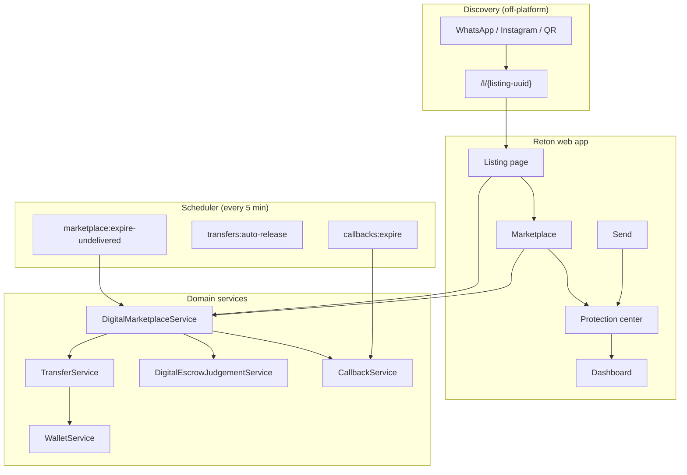
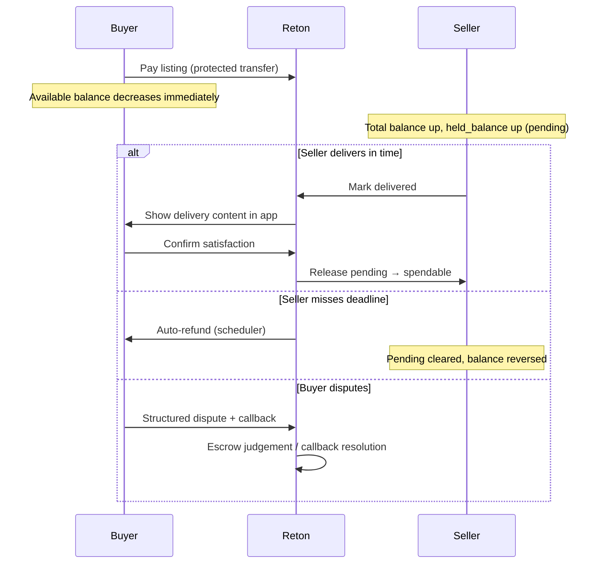
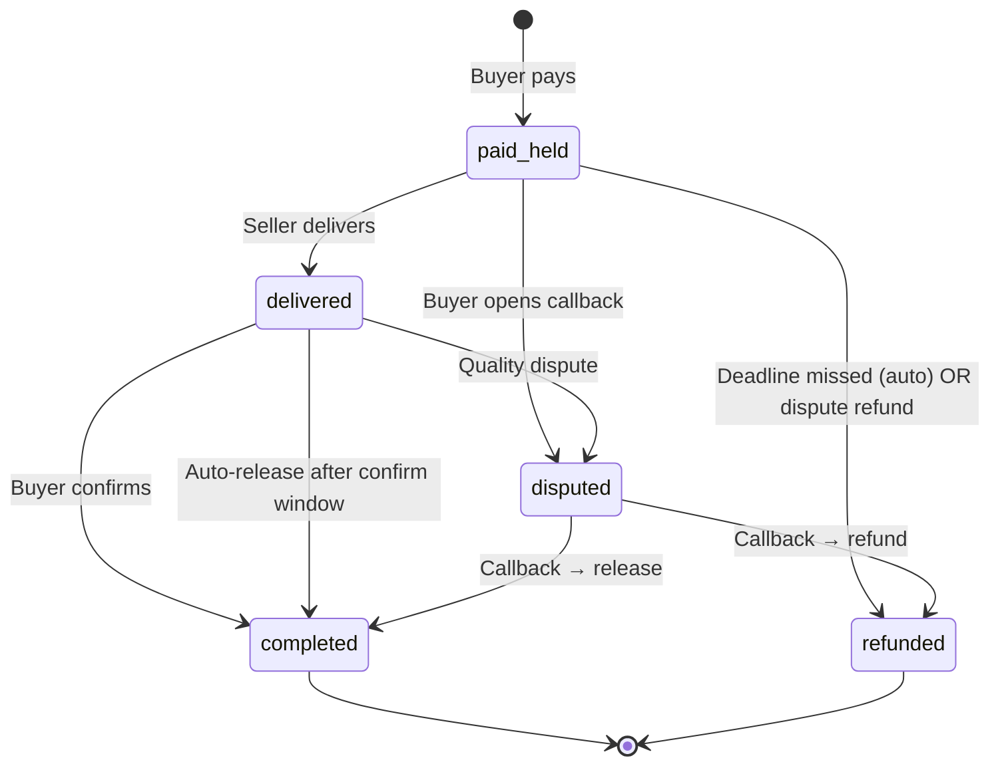
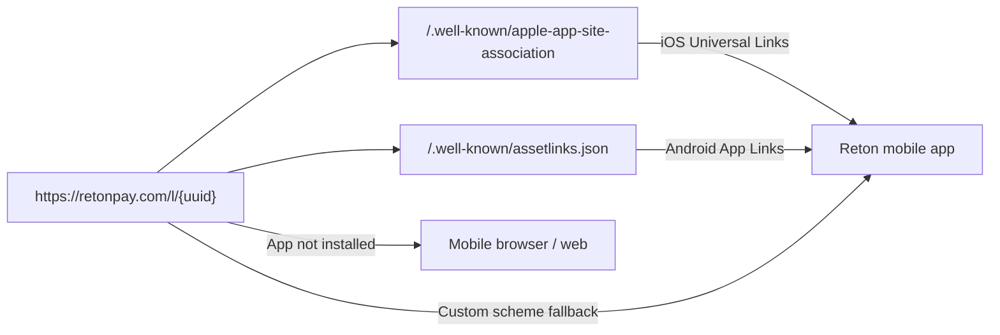

# Reton release brief - 30 June 2026

A team walkthrough of what shipped that day: new pages, money flows, and how the pieces connect. Use this when onboarding someone to the product or rehearsing a demo.

**Company:** RETON PTE LTD · **Founder & CEO:** Gabriel Rotimi Mogaji · **Co-Founder:** Aina Christana Olajumoke  
**Screenshots:** [`screenshots/`](screenshots/)  
**Regenerate:** with the app running (`php artisan serve`), run `node scripts/capture-release-screenshots.mjs`

Sandbox logins only when `RETON_DEMO_MODE=true` on a private environment. Credentials live in your local / Cloud secrets (`RETON_DEMO_*`) - never commit them and never enable demo mode on public production.

---

## 1. What's new (at a glance)

| Area | What changed | Screenshot |
|------|----------------|------------|
| **Shareable listing page** | Public `/l/{uuid}` link for WhatsApp/social; guest preview + sign-in to buy | [Guest listing](screenshots/01-listing-share-guest.png) · [Seller share + QR](screenshots/02-listing-share-seller-qr.png) |
| **Digital marketplace** | Sell/buy digital items with Reton protection, active orders, past orders | [Seller view](screenshots/03-marketplace-seller.png) · [Buyer browse](screenshots/08-marketplace-buyer-view.png) |
| **Create listing** | Guided modal: description vs private delivery payload, accuracy checkbox | [Create modal](screenshots/04-create-listing-modal.png) |
| **Dashboard balance** | Hero = **Available to spend**; pending incoming shown separately | [Dashboard](screenshots/05-dashboard-balance.png) |
| **Send - Protected** | Sender debited immediately; receiver sees **pending** until release/refund | [Send](screenshots/06-send-protected.png) |
| **Protection center** | Held transfers, callbacks, recoveries + digital order escrow cards | [Protection](screenshots/07-protection-center.png) |
| **Buyer signed-in listing** | Same share link after login - pay with PIN on the page | [Buyer listing](screenshots/09-listing-share-buyer-signed-in.png) |

Full changelog: [`CHANGELOG.md`](../../CHANGELOG.md)

---

## 2. System topology

### 2.1 High-level product map



**Reading the map:** sellers share **one URL** (`/l/…`) instead of asking buyers to hunt inside Marketplace. Purchases create a **digital order + protected transfer**. Money and disputes flow through the same protection stack as P2P sends.

---

### 2.2 Digital sale money flow (protected settlement)



**Key idea:** funds never sit in a separate escrow account. The receiver's wallet shows **pending** (`held_balance`) until release or refund - same model as protected Send.

---

### 2.3 Digital order state machine



Configurable windows (`config/reton.php` → `digital.*`):
- **Delivery deadline** - default 72h (auto-refund if undelivered)
- **Dispute grace** - default 24h before early "not delivered" dispute
- **Confirm window** - default 48h after delivery

---

### 2.4 Share link → mobile app (future)



Web and mobile share the **same path** (`/l/*`). When apps ship, set `RETON_APPLE_TEAM_ID`, `RETON_ANDROID_SHA256`, etc. in `.env` (see `.env.example`).

---

## 3. Page-by-page notes (for demos)

### Listing share page (`/l/{uuid}`)
- **Guest:** product preview, price, seller name, Sign in / Create account (redirects back to listing).
- **Seller (owner):** copy link, native share sheet, QR for in-person handoff.
- **Buyer (signed in):** PIN + "Pay with protection".
- After publish, sellers are redirected here automatically.

### Marketplace (`/marketplace`)
- Browse other users' listings, your listings with inline share tools, active/past digital orders with escrow stepper cards.
- Seller must **Mark delivered** before buyer can confirm.

### Dashboard
- **Available to spend** is the primary number.
- If you have pending incoming protected funds, an amber pill and **Total in wallet** appear.

### Send
- **Standard** - instant, final.
- **Protected** - receiver pending; sender can recall via callback until release.

### Protection center
- All held transfers, open callbacks, recoveries.
- Digital orders appear with step labels, dispute categories, and auto-refund deadline copy for buyers.

---

## 4. Backend components (for engineers)

| Component | Role |
|-----------|------|
| `DigitalMarketplaceService` | Listings, purchase, deliver, confirm, dispute, auto-refund |
| `DigitalEscrowJudgementService` | Trust score, dispute eligibility, buyer/seller guidance |
| `ListingLinks` | Canonical web + app URLs |
| `ExpireUndeliveredDigitalOrders` | Scheduler: auto-refund overdue `paid_held` orders |
| `TransferService` + `WalletService` | Protected debit / pending credit / release / refund |
| `WellKnownController` | Mobile association files for deep links |
| `TrustProtectionChanged` + Reverb | Live reload on Dashboard / Protection |

---

## 5. Suggested demo script (5 minutes)

1. **Bola** - Marketplace → Your listings → Copy link (show QR). Paste link narrative for WhatsApp.
2. **Ada** (guest/incognito) - open `/l/…` → Sign in → Pay with protection (enter transaction PIN).
3. **Bola** - Marketplace → Active order → Mark delivered.
4. **Ada** - open delivery content → Confirm (or show dispute options).
5. **Optional:** Protection center → show pending transfer; Dashboard → available vs pending.

---

## 6. Files in this folder

```
docs/release-2026-06-30/
├── TEAM_BRIEF.md          ← this document
├── screenshot-meta.json   ← listing/order IDs used for captures
└── screenshots/
    ├── 01-listing-share-guest.png
    ├── 02-listing-share-seller-qr.png
    ├── …
    └── 09-listing-share-buyer-signed-in.png
```
