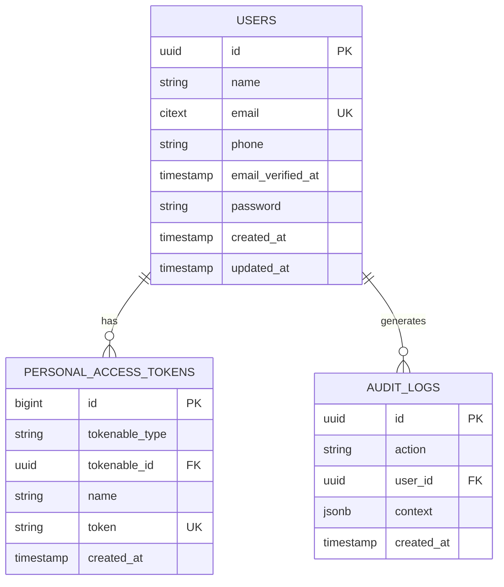

# Reton M0 — Foundation Implementation Plan

> **For agentic workers:** REQUIRED SUB-SKILL: Use superpowers:subagent-driven-development (recommended) or superpowers:executing-plans to implement this plan task-by-task. Steps use checkbox (`- [ ]`) syntax for tracking.

**Goal:** Stand up a runnable, CI-green, contract-first Laravel 12 + React skeleton with a DDD module structure, a token-auth scaffold, and the project-wide API/audit/idempotency conventions every later milestone inherits.

**Architecture:** A monorepo with a Laravel 12 modular monolith (`backend/`), a minimal React+TypeScript client (`frontend/`), and Docker infra (`infra/`). Domains live under `app/Domains/{Domain}/` in three layers (Domain / Application / Infrastructure) whose inward-only dependency direction is enforced by a Pest architecture test. API contracts are authored as hand-written OpenAPI YAML before implementation; the frontend consumes a client generated from that YAML. No business/money logic ships in M0.

**Tech Stack:** PHP 8.4, Laravel 12, Laravel Sanctum, Pest, Larastan (PHPStan level 8), Laravel Pint, PostgreSQL 16, Redis 7, Docker Compose, GitHub Actions, React + Vite + TypeScript, TanStack Query, Zustand, `openapi-typescript`.

## Global Constraints

- PHP **8.4+**, Laravel **12**. (CLAUDE.md)
- API base path is **`/api/v1`** for every endpoint. (Roadmap §7, M0 spec §5)
- All API responses use the standard envelope: success `{ "data", "meta" }`, error `{ "error": { "code", "message" } }`, validation `{ "error": { "code": "validation_error", "message", "fields" } }`, paginated `{ "data": [...], "meta": { "page", "per_page", "total" } }`. (M0 spec §5)
- Primary keys are **UUID v7**. Money is **never** floats — minor-units integers only (not exercised in M0 but the rule stands). (M0 spec §11, roadmap §7)
- **No balance mutation / money logic in M0.** Auth scaffold is register/login/logout/me only; PIN, 2FA, device fingerprinting, verification are typed stubs, not implementations. (M0 spec §1, §6)
- DDD dependency rule: `Domain/` depends on nothing framework-y; `Application/` depends only on `Domain/`; `Http/` and `Infrastructure/` depend inward. Enforced by a CI architecture test. (M0 spec §3)
- `audit_logs` is **append-only**. (M0 spec §7)
- Static analysis runs at **Larastan level 8**; CI gates lint + static + tests + contract check. Coverage is reported, not gated, in M0. (M0 spec §8)
- Secrets are never committed; `.env.example` is the only committed env file. (M0 spec §4)

---

### Task 1: Repository skeleton and git init

**Files:**
- Create: `.gitignore`
- Create: `README.md`
- Create: `.editorconfig`

**Interfaces:**
- Consumes: nothing (first task; directory currently holds only `CLAUDE.md` and `docs/`).
- Produces: an initialized git repo on branch `main` with ignore rules later tasks rely on.

- [ ] **Step 1: Initialize git and set default branch**

Run:
```bash
cd /home/rotense/Documents/code/reton
git init -b main
```
Expected: `Initialized empty Git repository`.

- [ ] **Step 2: Write `.gitignore`**

```gitignore
# PHP / Laravel
/backend/vendor/
/backend/node_modules/
/backend/.env
/backend/.phpunit.result.cache
/backend/storage/*.key
/backend/storage/logs/*
/backend/storage/framework/cache/data/*
/backend/storage/framework/sessions/*
/backend/storage/framework/views/*
/backend/bootstrap/cache/*

# Frontend
/frontend/node_modules/
/frontend/dist/
/frontend/.env

# Tooling
.DS_Store
*.log
.idea/
.vscode/
```

- [ ] **Step 3: Write `.editorconfig`**

```ini
root = true

[*]
charset = utf-8
end_of_line = lf
insert_final_newline = true
trim_trailing_whitespace = true
indent_style = space

[*.{php,yaml,yml,json}]
indent_size = 4

[*.{ts,tsx,js,jsx}]
indent_size = 2
```

- [ ] **Step 4: Write `README.md` (placeholder, filled in Task 14)**

```markdown
# Reton

Trust-based African fintech platform. See `docs/superpowers/specs/` for the build roadmap and milestone specs.

Setup instructions: see Task 14 / completed in M0.
```

- [ ] **Step 5: Commit**

```bash
git add -A
git commit -m "chore: repository skeleton, gitignore, editorconfig"
```

---

### Task 2: Docker infrastructure (app, nginx, postgres, redis, queue)

**Files:**
- Create: `infra/docker-compose.yml`
- Create: `infra/docker/php/Dockerfile`
- Create: `infra/docker/nginx/default.conf`

**Interfaces:**
- Consumes: nothing yet (Laravel app is created in Task 3; compose references `../backend`).
- Produces: a `docker compose up` stack exposing nginx on `:8080`, Postgres on `:5432`, Redis on `:6379`. Service name `postgres`/`redis` are the hostnames Laravel `.env` will use in Task 3.

- [ ] **Step 1: Write the PHP Dockerfile**

`infra/docker/php/Dockerfile`:
```dockerfile
FROM php:8.4-fpm-alpine

RUN apk add --no-cache postgresql-dev $PHPIZE_DEPS \
    && docker-php-ext-install pdo pdo_pgsql bcmath \
    && pecl install redis \
    && docker-php-ext-enable redis \
    && apk del $PHPIZE_DEPS

COPY --from=composer:2 /usr/bin/composer /usr/bin/composer

WORKDIR /var/www/html
```

- [ ] **Step 2: Write the nginx config**

`infra/docker/nginx/default.conf`:
```nginx
server {
    listen 80;
    root /var/www/html/public;
    index index.php;

    location / {
        try_files $uri $uri/ /index.php?$query_string;
    }

    location ~ \.php$ {
        fastcgi_pass app:9000;
        fastcgi_index index.php;
        include fastcgi_params;
        fastcgi_param SCRIPT_FILENAME $document_root$fastcgi_script_name;
    }
}
```

- [ ] **Step 3: Write `docker-compose.yml`**

`infra/docker-compose.yml`:
```yaml
services:
  app:
    build:
      context: ../backend
      dockerfile: ../infra/docker/php/Dockerfile
    volumes:
      - ../backend:/var/www/html
    depends_on:
      postgres:
        condition: service_healthy
      redis:
        condition: service_healthy
    environment:
      - DB_HOST=postgres
      - REDIS_HOST=redis

  nginx:
    image: nginx:1.27-alpine
    ports:
      - "8080:80"
    volumes:
      - ../backend:/var/www/html
      - ./docker/nginx/default.conf:/etc/nginx/conf.d/default.conf
    depends_on:
      - app

  postgres:
    image: postgres:16-alpine
    environment:
      POSTGRES_DB: reton
      POSTGRES_USER: reton
      POSTGRES_PASSWORD: secret
    ports:
      - "5432:5432"
    volumes:
      - pgdata:/var/lib/postgresql/data
    healthcheck:
      test: ["CMD-SHELL", "pg_isready -U reton"]
      interval: 5s
      timeout: 3s
      retries: 5

  redis:
    image: redis:7-alpine
    ports:
      - "6379:6379"
    healthcheck:
      test: ["CMD", "redis-cli", "ping"]
      interval: 5s
      timeout: 3s
      retries: 5

  queue:
    build:
      context: ../backend
      dockerfile: ../infra/docker/php/Dockerfile
    command: php artisan queue:work --tries=3
    volumes:
      - ../backend:/var/www/html
    depends_on:
      - app
    environment:
      - DB_HOST=postgres
      - REDIS_HOST=redis

volumes:
  pgdata:
```

- [ ] **Step 4: Validate compose syntax**

Run: `docker compose -f infra/docker-compose.yml config -q`
Expected: no output, exit code 0. (Build/up is verified after Task 3 when the Laravel app exists.)

- [ ] **Step 5: Commit**

```bash
git add infra/
git commit -m "chore: docker compose stack (app, nginx, postgres, redis, queue)"
```

---

### Task 3: Laravel 12 app + tooling (Pint, Larastan, Pest)

**Files:**
- Create: `backend/` (full Laravel 12 skeleton via installer)
- Create: `backend/pint.json`
- Create: `backend/phpstan.neon`
- Modify: `backend/.env.example`, `backend/composer.json` (dev deps)

**Interfaces:**
- Consumes: Docker stack from Task 2 (Postgres host `postgres`, Redis host `redis`).
- Produces: a bootable Laravel app; `composer test`, `composer lint`, `composer analyse` scripts that later CI calls.

- [ ] **Step 1: Create the Laravel 12 project**

Run:
```bash
cd /home/rotense/Documents/code/reton
composer create-project laravel/laravel backend "12.*"
```
Expected: `backend/` populated; `php backend/artisan --version` prints `Laravel Framework 12.x`.

- [ ] **Step 2: Add dev tooling**

Run:
```bash
cd /home/rotense/Documents/code/reton/backend
composer require --dev laravel/pint larastan/larastan pestphp/pest pestphp/pest-plugin-laravel
./vendor/bin/pest --init
```
Expected: Pest installs and creates `tests/Pest.php`.

- [ ] **Step 3: Configure Larastan at level 8**

`backend/phpstan.neon`:
```neon
includes:
    - vendor/larastan/larastan/extension.neon

parameters:
    level: 8
    paths:
        - app
    ignoreErrors: []
```

- [ ] **Step 4: Configure Pint**

`backend/pint.json`:
```json
{
    "preset": "laravel"
}
```

- [ ] **Step 5: Add composer scripts**

In `backend/composer.json`, add to the `"scripts"` object:
```json
"lint": "pint --test",
"lint:fix": "pint",
"analyse": "phpstan analyse --memory-limit=512M",
"test": "pest"
```

- [ ] **Step 6: Point `.env` at Postgres + Redis**

In `backend/.env` and `backend/.env.example`, set:
```env
DB_CONNECTION=pgsql
DB_HOST=postgres
DB_PORT=5432
DB_DATABASE=reton
DB_USERNAME=reton
DB_PASSWORD=secret

CACHE_STORE=redis
QUEUE_CONNECTION=redis
REDIS_HOST=redis
```

- [ ] **Step 7: Bring up the stack and run migrations**

Run:
```bash
cd /home/rotense/Documents/code/reton
docker compose -f infra/docker-compose.yml up -d --build
docker compose -f infra/docker-compose.yml exec app php artisan key:generate
docker compose -f infra/docker-compose.yml exec app php artisan migrate
```
Expected: containers healthy; default Laravel migrations run.

- [ ] **Step 8: Verify the app responds**

Run: `curl -s -o /dev/null -w "%{http_code}" http://localhost:8080`
Expected: `200`.

- [ ] **Step 9: Commit**

```bash
git add backend/
git commit -m "chore: Laravel 12 app with Pint, Larastan level 8, Pest"
```

---

### Task 4: API response envelope + exception mapping

**Files:**
- Create: `backend/app/Support/Http/ApiResponse.php`
- Modify: `backend/bootstrap/app.php` (register exception renderers)
- Test: `backend/tests/Unit/ApiResponseTest.php`, `backend/tests/Feature/ApiErrorShapeTest.php`

**Interfaces:**
- Consumes: nothing.
- Produces: `ApiResponse::success(array|JsonSerializable $data, array $meta = [], int $status = 200): JsonResponse`, `ApiResponse::error(string $code, string $message, int $status): JsonResponse`. Validation (422) and not-found/auth errors render via the exception handler in the standard shape. Controllers in later tasks call these.

- [ ] **Step 1: Write the failing unit test**

`backend/tests/Unit/ApiResponseTest.php`:
```php
<?php

use App\Support\Http\ApiResponse;

it('wraps data in the success envelope', function () {
    $response = ApiResponse::success(['id' => 1], ['page' => 1]);

    expect($response->getStatusCode())->toBe(200)
        ->and($response->getData(true))->toBe([
            'data' => ['id' => 1],
            'meta' => ['page' => 1],
        ]);
});

it('renders the error envelope', function () {
    $response = ApiResponse::error('not_found', 'Missing', 404);

    expect($response->getStatusCode())->toBe(404)
        ->and($response->getData(true))->toBe([
            'error' => ['code' => 'not_found', 'message' => 'Missing'],
        ]);
});
```

- [ ] **Step 2: Run test to verify it fails**

Run: `cd backend && ./vendor/bin/pest tests/Unit/ApiResponseTest.php`
Expected: FAIL — `Class "App\Support\Http\ApiResponse" not found`.

- [ ] **Step 3: Implement `ApiResponse`**

`backend/app/Support/Http/ApiResponse.php`:
```php
<?php

namespace App\Support\Http;

use Illuminate\Http\JsonResponse;

final class ApiResponse
{
    public static function success(mixed $data, array $meta = [], int $status = 200): JsonResponse
    {
        $payload = ['data' => $data];

        if ($meta !== []) {
            $payload['meta'] = $meta;
        }

        return response()->json($payload, $status);
    }

    public static function error(string $code, string $message, int $status): JsonResponse
    {
        return response()->json([
            'error' => ['code' => $code, 'message' => $message],
        ], $status);
    }
}
```

- [ ] **Step 4: Map exceptions to the envelope**

In `backend/bootstrap/app.php`, inside `->withExceptions(function (Exceptions $exceptions) {` add:
```php
use App\Support\Http\ApiResponse;
use Illuminate\Auth\AuthenticationException;
use Illuminate\Database\Eloquent\ModelNotFoundException;
use Illuminate\Validation\ValidationException;
use Symfony\Component\HttpKernel\Exception\NotFoundHttpException;

$exceptions->render(function (ValidationException $e, $request) {
    if ($request->is('api/*')) {
        return response()->json([
            'error' => [
                'code' => 'validation_error',
                'message' => 'The given data was invalid.',
                'fields' => $e->errors(),
            ],
        ], 422);
    }
});

$exceptions->render(function (AuthenticationException $e, $request) {
    if ($request->is('api/*')) {
        return ApiResponse::error('unauthenticated', 'Unauthenticated.', 401);
    }
});

$exceptions->render(function (ModelNotFoundException|NotFoundHttpException $e, $request) {
    if ($request->is('api/*')) {
        return ApiResponse::error('not_found', 'Resource not found.', 404);
    }
});
```

- [ ] **Step 5: Write the failing feature test for error shape**

`backend/tests/Feature/ApiErrorShapeTest.php`:
```php
<?php

it('returns the standard not_found envelope for unknown api routes', function () {
    $this->getJson('/api/v1/does-not-exist')
        ->assertStatus(404)
        ->assertExactJson(['error' => ['code' => 'not_found', 'message' => 'Resource not found.']]);
});
```

- [ ] **Step 6: Run all tests**

Run: `cd backend && ./vendor/bin/pest tests/Unit/ApiResponseTest.php tests/Feature/ApiErrorShapeTest.php`
Expected: PASS (4 assertions across the files).

- [ ] **Step 7: Commit**

```bash
git add backend/app/Support backend/bootstrap/app.php backend/tests
git commit -m "feat: standard API response envelope and exception mapping"
```

---

### Task 5: Cross-cutting middleware (correlation ID, idempotency, rate limit)

**Files:**
- Create: `backend/app/Support/Http/Middleware/CorrelationId.php`
- Create: `backend/app/Support/Http/Middleware/IdempotencyKey.php`
- Modify: `backend/bootstrap/app.php` (register middleware), `backend/routes/api.php` (v1 group)
- Test: `backend/tests/Feature/CorrelationIdTest.php`, `backend/tests/Feature/IdempotencyTest.php`

**Interfaces:**
- Consumes: `ApiResponse` (Task 4), Redis cache (Task 3).
- Produces: a `correlation-id` middleware alias and an `idempotency` middleware alias usable in route definitions. Idempotency stores the first response body for a given `Idempotency-Key` header in the cache for 24h and replays it on repeat.

- [ ] **Step 1: Write the failing correlation-id test**

`backend/tests/Feature/CorrelationIdTest.php`:
```php
<?php

it('echoes a supplied request id and generates one when absent', function () {
    $this->getJson('/api/v1/health', ['X-Request-Id' => 'abc-123'])
        ->assertHeader('X-Request-Id', 'abc-123');

    $response = $this->getJson('/api/v1/health');
    expect($response->headers->get('X-Request-Id'))->not->toBeNull();
});
```

- [ ] **Step 2: Run it to confirm failure**

Run: `cd backend && ./vendor/bin/pest tests/Feature/CorrelationIdTest.php`
Expected: FAIL — `/api/v1/health` route does not exist yet AND header missing.

- [ ] **Step 3: Implement the correlation-id middleware**

`backend/app/Support/Http/Middleware/CorrelationId.php`:
```php
<?php

namespace App\Support\Http\Middleware;

use Closure;
use Illuminate\Http\Request;
use Illuminate\Support\Facades\Log;
use Illuminate\Support\Str;
use Symfony\Component\Uid\Uuid;

class CorrelationId
{
    public function handle(Request $request, Closure $next)
    {
        $id = $request->header('X-Request-Id') ?: (string) Uuid::v7();
        $request->headers->set('X-Request-Id', $id);
        Log::withContext(['request_id' => $id]);

        $response = $next($request);
        $response->headers->set('X-Request-Id', $id);

        return $response;
    }
}
```

- [ ] **Step 4: Implement the idempotency middleware**

`backend/app/Support/Http/Middleware/IdempotencyKey.php`:
```php
<?php

namespace App\Support\Http\Middleware;

use Closure;
use Illuminate\Http\Request;
use Illuminate\Support\Facades\Cache;

class IdempotencyKey
{
    public function handle(Request $request, Closure $next)
    {
        $key = $request->header('Idempotency-Key');

        if (! $key) {
            return $next($request);
        }

        $cacheKey = "idempotency:{$key}";

        if (Cache::has($cacheKey)) {
            $stored = Cache::get($cacheKey);

            return response($stored['body'], $stored['status'])
                ->header('Content-Type', 'application/json')
                ->header('Idempotency-Replayed', 'true');
        }

        $response = $next($request);

        Cache::put($cacheKey, [
            'body' => $response->getContent(),
            'status' => $response->getStatusCode(),
        ], now()->addHours(24));

        return $response;
    }
}
```

- [ ] **Step 5: Register aliases and the v1 group**

In `backend/bootstrap/app.php` inside `->withMiddleware(function (Middleware $middleware) {`:
```php
$middleware->alias([
    'correlation-id' => \App\Support\Http\Middleware\CorrelationId::class,
    'idempotency' => \App\Support\Http\Middleware\IdempotencyKey::class,
]);
$middleware->api(prepend: [\App\Support\Http\Middleware\CorrelationId::class]);
```

Replace `backend/routes/api.php` contents with the v1 group + a health route:
```php
<?php

use App\Support\Http\ApiResponse;
use Illuminate\Support\Facades\Route;

Route::prefix('v1')->group(function () {
    Route::get('/health', fn () => ApiResponse::success(['status' => 'ok']));
});
```

- [ ] **Step 6: Write the failing idempotency test**

`backend/tests/Feature/IdempotencyTest.php`:
```php
<?php

use Illuminate\Support\Facades\Route;
use App\Support\Http\ApiResponse;

it('replays the stored response for a repeated idempotency key', function () {
    Route::middleware(['idempotency'])->post('/api/v1/_test/idem', function () {
        return ApiResponse::success(['nonce' => uniqid()], status: 201);
    });

    $first = $this->postJson('/api/v1/_test/idem', [], ['Idempotency-Key' => 'k-1']);
    $second = $this->postJson('/api/v1/_test/idem', [], ['Idempotency-Key' => 'k-1']);

    expect($second->getContent())->toBe($first->getContent())
        ->and($second->headers->get('Idempotency-Replayed'))->toBe('true');
});
```

- [ ] **Step 7: Run the middleware tests**

Run: `cd backend && ./vendor/bin/pest tests/Feature/CorrelationIdTest.php tests/Feature/IdempotencyTest.php`
Expected: PASS.

- [ ] **Step 8: Commit**

```bash
git add backend/app/Support backend/bootstrap/app.php backend/routes/api.php backend/tests
git commit -m "feat: correlation-id and idempotency middleware, /api/v1 group + health"
```

---

### Task 6: Authentication domain skeleton + users migration

**Files:**
- Create: `backend/app/Domains/Authentication/Domain/Contracts/UserRepository.php`
- Create: `backend/app/Domains/Authentication/Domain/Contracts/DeviceFingerprintService.php`
- Create: `backend/app/Domains/Authentication/Domain/Contracts/TwoFactorService.php`
- Create: `backend/app/Domains/Authentication/Infrastructure/EloquentUserRepository.php`
- Create: `backend/app/Domains/Authentication/Infrastructure/Stubs/NullDeviceFingerprintService.php`
- Create: `backend/app/Domains/Authentication/Infrastructure/Stubs/NullTwoFactorService.php`
- Create: `backend/database/migrations/2026_06_22_000001_enable_citext.php`
- Modify: `backend/database/migrations/0001_01_01_000000_create_users_table.php` (UUID v7 + phone)
- Modify: `backend/app/Models/User.php` (UUID keys, HasApiTokens)
- Create: `backend/app/Providers/DomainServiceProvider.php`
- Test: `backend/tests/Feature/UserRegistrationStorageTest.php`

**Interfaces:**
- Consumes: nothing from prior money tasks.
- Produces: `UserRepository` with `create(array $attributes): User` and `findByEmail(string $email): ?User`. Typed stub services `DeviceFingerprintService::fingerprint(Request): string` and `TwoFactorService::isRequired(User): bool` (null impls) for M3 to fill. `users` table keyed by UUID v7 with `phone` and `citext` email.

- [ ] **Step 1: Write the failing storage test**

`backend/tests/Feature/UserRegistrationStorageTest.php`:
```php
<?php

use App\Domains\Authentication\Domain\Contracts\UserRepository;

it('persists a user with a uuid primary key via the repository', function () {
    $repo = app(UserRepository::class);

    $user = $repo->create([
        'name' => 'Ada',
        'email' => 'ada@example.com',
        'phone' => '+2348000000000',
        'password' => 'secret-password',
    ]);

    expect($user->id)->toBeString()
        ->and(strlen($user->id))->toBe(36)
        ->and($repo->findByEmail('ADA@example.com')?->id)->toBe($user->id);
});
```

- [ ] **Step 2: Run it to confirm failure**

Run: `cd backend && ./vendor/bin/pest tests/Feature/UserRegistrationStorageTest.php`
Expected: FAIL — `UserRepository` not bound.

- [ ] **Step 3: Enable citext + reshape the users migration**

`backend/database/migrations/2026_06_22_000001_enable_citext.php`:
```php
<?php

use Illuminate\Database\Migrations\Migration;
use Illuminate\Support\Facades\DB;

return new class extends Migration
{
    public function up(): void
    {
        DB::statement('CREATE EXTENSION IF NOT EXISTS citext');
    }

    public function down(): void
    {
        DB::statement('DROP EXTENSION IF EXISTS citext');
    }
};
```

In `0001_01_01_000000_create_users_table.php`, replace the `users` table definition with:
```php
Schema::create('users', function (Blueprint $table) {
    $table->uuid('id')->primary();
    $table->string('name');
    $table->string('email')->unique();          // citext applied below
    $table->string('phone')->nullable();
    $table->timestamp('email_verified_at')->nullable();
    $table->string('password');
    $table->rememberToken();
    $table->timestamps();
});
DB::statement('ALTER TABLE users ALTER COLUMN email TYPE citext');
```
Add `use Illuminate\Support\Facades\DB;` to that migration's imports. (Note: the citext migration must run before the users table — rename its timestamp prefix to sort first if needed, e.g. `0001_01_01_000000` keeps users; give citext `0001_01_01_000000`-earlier by using `2026_06_22_000000`. Ensure citext migration sorts BEFORE users.)

> Correction for ordering: name the citext migration `0000_00_00_000000_enable_citext.php` so it runs first.

- [ ] **Step 4: Make the User model UUID + token aware**

`backend/app/Models/User.php` — set the class body to:
```php
<?php

namespace App\Models;

use Illuminate\Database\Eloquent\Concerns\HasUuids;
use Illuminate\Foundation\Auth\User as Authenticatable;
use Illuminate\Notifications\Notifiable;
use Laravel\Sanctum\HasApiTokens;
use Symfony\Component\Uid\Uuid;

class User extends Authenticatable
{
    use HasApiTokens, HasUuids, Notifiable;

    protected $fillable = ['name', 'email', 'phone', 'password'];
    protected $hidden = ['password', 'remember_token'];
    protected $casts = ['email_verified_at' => 'datetime', 'password' => 'hashed'];

    public function newUniqueId(): string
    {
        return (string) Uuid::v7();
    }

    public function uniqueIds(): array
    {
        return ['id'];
    }
}
```

- [ ] **Step 5: Define domain contracts**

`backend/app/Domains/Authentication/Domain/Contracts/UserRepository.php`:
```php
<?php

namespace App\Domains\Authentication\Domain\Contracts;

use App\Models\User;

interface UserRepository
{
    public function create(array $attributes): User;

    public function findByEmail(string $email): ?User;
}
```

`backend/app/Domains/Authentication/Domain/Contracts/DeviceFingerprintService.php`:
```php
<?php

namespace App\Domains\Authentication\Domain\Contracts;

use Illuminate\Http\Request;

interface DeviceFingerprintService
{
    public function fingerprint(Request $request): string;
}
```

`backend/app/Domains/Authentication/Domain/Contracts/TwoFactorService.php`:
```php
<?php

namespace App\Domains\Authentication\Domain\Contracts;

use App\Models\User;

interface TwoFactorService
{
    public function isRequired(User $user): bool;
}
```

- [ ] **Step 6: Implement repository + null stubs**

`backend/app/Domains/Authentication/Infrastructure/EloquentUserRepository.php`:
```php
<?php

namespace App\Domains\Authentication\Infrastructure;

use App\Domains\Authentication\Domain\Contracts\UserRepository;
use App\Models\User;

class EloquentUserRepository implements UserRepository
{
    public function create(array $attributes): User
    {
        return User::create($attributes);
    }

    public function findByEmail(string $email): ?User
    {
        return User::query()->where('email', $email)->first();
    }
}
```

`backend/app/Domains/Authentication/Infrastructure/Stubs/NullDeviceFingerprintService.php`:
```php
<?php

namespace App\Domains\Authentication\Infrastructure\Stubs;

use App\Domains\Authentication\Domain\Contracts\DeviceFingerprintService;
use Illuminate\Http\Request;

class NullDeviceFingerprintService implements DeviceFingerprintService
{
    public function fingerprint(Request $request): string
    {
        return 'unimplemented';
    }
}
```

`backend/app/Domains/Authentication/Infrastructure/Stubs/NullTwoFactorService.php`:
```php
<?php

namespace App\Domains\Authentication\Infrastructure\Stubs;

use App\Domains\Authentication\Domain\Contracts\TwoFactorService;
use App\Models\User;

class NullTwoFactorService implements TwoFactorService
{
    public function isRequired(User $user): bool
    {
        return false;
    }
}
```

- [ ] **Step 7: Bind contracts in a domain service provider**

`backend/app/Providers/DomainServiceProvider.php`:
```php
<?php

namespace App\Providers;

use App\Domains\Authentication\Domain\Contracts\DeviceFingerprintService;
use App\Domains\Authentication\Domain\Contracts\TwoFactorService;
use App\Domains\Authentication\Domain\Contracts\UserRepository;
use App\Domains\Authentication\Infrastructure\EloquentUserRepository;
use App\Domains\Authentication\Infrastructure\Stubs\NullDeviceFingerprintService;
use App\Domains\Authentication\Infrastructure\Stubs\NullTwoFactorService;
use Illuminate\Support\ServiceProvider;

class DomainServiceProvider extends ServiceProvider
{
    public function register(): void
    {
        $this->app->bind(UserRepository::class, EloquentUserRepository::class);
        $this->app->bind(DeviceFingerprintService::class, NullDeviceFingerprintService::class);
        $this->app->bind(TwoFactorService::class, NullTwoFactorService::class);
    }
}
```

Register it in `backend/bootstrap/providers.php` by adding `App\Providers\DomainServiceProvider::class,` to the returned array.

- [ ] **Step 8a: Fix Sanctum token table for UUID users**

Sanctum's default `create_personal_access_tokens_table` migration types `tokenable_id` as `bigint`, which cannot reference our UUID users. Install Sanctum and fix the morph type:

Run: `cd backend && composer require laravel/sanctum && php artisan vendor:publish --provider="Laravel\Sanctum\SanctumServiceProvider"`

Then in `backend/database/migrations/*_create_personal_access_tokens_table.php`, replace `$table->morphs('tokenable');` with:
```php
$table->uuidMorphs('tokenable');
```

- [ ] **Step 8: Configure PSR-4 autoload for Domains**

In `backend/composer.json`, the existing `"App\\": "app/"` autoload rule already covers `app/Domains`. Run `composer dump-autoload` to be safe.

Run: `cd backend && composer dump-autoload`
Expected: autoload regenerated, no errors.

- [ ] **Step 9: Run the storage test (with DB)**

Run:
```bash
cd /home/rotense/Documents/code/reton
docker compose -f infra/docker-compose.yml exec app php artisan migrate:fresh
docker compose -f infra/docker-compose.yml exec app ./vendor/bin/pest tests/Feature/UserRegistrationStorageTest.php
```
Expected: PASS (case-insensitive email lookup returns the created user).

- [ ] **Step 10: Commit**

```bash
git add backend/app backend/database backend/bootstrap/providers.php backend/composer.json
git commit -m "feat: authentication domain skeleton, uuid users, citext email, typed security stubs"
```

---

### Task 7: Register / login / logout / me endpoints

**Files:**
- Create: `backend/app/Domains/Authentication/Application/RegisterUserHandler.php`
- Create: `backend/app/Domains/Authentication/Application/LoginUserHandler.php`
- Create: `backend/app/Http/Controllers/Api/V1/Auth/AuthController.php`
- Create: `backend/app/Http/Requests/Api/V1/Auth/RegisterRequest.php`
- Create: `backend/app/Http/Requests/Api/V1/Auth/LoginRequest.php`
- Create: `backend/app/Http/Resources/Api/V1/UserResource.php`
- Modify: `backend/routes/api.php`
- Test: `backend/tests/Feature/Auth/AuthFlowTest.php`

**Interfaces:**
- Consumes: `UserRepository` (Task 6), `ApiResponse` (Task 4), `audit` logger arrives in Task 8 — auth events are logged there, so this task does NOT call audit yet.
- Produces: routes `POST /api/v1/auth/register`, `POST /api/v1/auth/login`, `POST /api/v1/auth/logout`, `GET /api/v1/auth/me`. `RegisterUserHandler::handle(array $data): User`, `LoginUserHandler::handle(string $email, string $password): ?User`.

- [ ] **Step 1: Write the failing auth flow test**

`backend/tests/Feature/Auth/AuthFlowTest.php`:
```php
<?php

use App\Models\User;

it('registers a user and returns a token', function () {
    $this->postJson('/api/v1/auth/register', [
        'name' => 'Ada',
        'email' => 'ada@example.com',
        'phone' => '+2348000000000',
        'password' => 'secret-password',
        'password_confirmation' => 'secret-password',
    ])->assertCreated()
      ->assertJsonStructure(['data' => ['user' => ['id', 'email'], 'token']]);
});

it('rejects login with wrong credentials in the standard error shape', function () {
    User::factory()->create(['email' => 'ada@example.com', 'password' => bcrypt('right-password')]);

    $this->postJson('/api/v1/auth/login', [
        'email' => 'ada@example.com',
        'password' => 'wrong-password',
    ])->assertStatus(401)
      ->assertJsonPath('error.code', 'invalid_credentials');
});

it('returns the authenticated user from me and revokes on logout', function () {
    $user = User::factory()->create();
    $token = $user->createToken('test')->plainTextToken;

    $this->withToken($token)->getJson('/api/v1/auth/me')
        ->assertOk()->assertJsonPath('data.id', $user->id);

    $this->withToken($token)->postJson('/api/v1/auth/logout')->assertOk();
});
```

- [ ] **Step 2: Run it to confirm failure**

Run: `cd backend && ./vendor/bin/pest tests/Feature/Auth/AuthFlowTest.php`
Expected: FAIL — auth routes do not exist.

- [ ] **Step 3: Form requests**

`backend/app/Http/Requests/Api/V1/Auth/RegisterRequest.php`:
```php
<?php

namespace App\Http\Requests\Api\V1\Auth;

use Illuminate\Foundation\Http\FormRequest;

class RegisterRequest extends FormRequest
{
    public function authorize(): bool
    {
        return true;
    }

    public function rules(): array
    {
        return [
            'name' => ['required', 'string', 'max:255'],
            'email' => ['required', 'email', 'unique:users,email'],
            'phone' => ['nullable', 'string', 'max:20'],
            'password' => ['required', 'string', 'min:8', 'confirmed'],
        ];
    }
}
```

`backend/app/Http/Requests/Api/V1/Auth/LoginRequest.php`:
```php
<?php

namespace App\Http\Requests\Api\V1\Auth;

use Illuminate\Foundation\Http\FormRequest;

class LoginRequest extends FormRequest
{
    public function authorize(): bool
    {
        return true;
    }

    public function rules(): array
    {
        return [
            'email' => ['required', 'email'],
            'password' => ['required', 'string'],
        ];
    }
}
```

- [ ] **Step 4: Application handlers**

`backend/app/Domains/Authentication/Application/RegisterUserHandler.php`:
```php
<?php

namespace App\Domains\Authentication\Application;

use App\Domains\Authentication\Domain\Contracts\UserRepository;
use App\Models\User;

final class RegisterUserHandler
{
    public function __construct(private readonly UserRepository $users) {}

    public function handle(array $data): User
    {
        return $this->users->create([
            'name' => $data['name'],
            'email' => $data['email'],
            'phone' => $data['phone'] ?? null,
            'password' => $data['password'],
        ]);
    }
}
```

`backend/app/Domains/Authentication/Application/LoginUserHandler.php`:
```php
<?php

namespace App\Domains\Authentication\Application;

use App\Domains\Authentication\Domain\Contracts\UserRepository;
use App\Models\User;
use Illuminate\Support\Facades\Hash;

final class LoginUserHandler
{
    public function __construct(private readonly UserRepository $users) {}

    public function handle(string $email, string $password): ?User
    {
        $user = $this->users->findByEmail($email);

        if (! $user || ! Hash::check($password, $user->password)) {
            return null;
        }

        return $user;
    }
}
```

- [ ] **Step 5: User resource + controller**

`backend/app/Http/Resources/Api/V1/UserResource.php`:
```php
<?php

namespace App\Http\Resources\Api\V1;

use Illuminate\Http\Resources\Json\JsonResource;

class UserResource extends JsonResource
{
    public function toArray($request): array
    {
        return [
            'id' => $this->id,
            'name' => $this->name,
            'email' => $this->email,
            'phone' => $this->phone,
        ];
    }
}
```

`backend/app/Http/Controllers/Api/V1/Auth/AuthController.php`:
```php
<?php

namespace App\Http\Controllers\Api\V1\Auth;

use App\Domains\Authentication\Application\LoginUserHandler;
use App\Domains\Authentication\Application\RegisterUserHandler;
use App\Http\Controllers\Controller;
use App\Http\Requests\Api\V1\Auth\LoginRequest;
use App\Http\Requests\Api\V1\Auth\RegisterRequest;
use App\Http\Resources\Api\V1\UserResource;
use App\Support\Http\ApiResponse;
use Illuminate\Http\Request;

class AuthController extends Controller
{
    public function register(RegisterRequest $request, RegisterUserHandler $handler)
    {
        $user = $handler->handle($request->validated());
        $token = $user->createToken('api')->plainTextToken;

        return ApiResponse::success([
            'user' => new UserResource($user),
            'token' => $token,
        ], status: 201);
    }

    public function login(LoginRequest $request, LoginUserHandler $handler)
    {
        $user = $handler->handle($request->validated()['email'], $request->validated()['password']);

        if (! $user) {
            return ApiResponse::error('invalid_credentials', 'Invalid email or password.', 401);
        }

        return ApiResponse::success([
            'user' => new UserResource($user),
            'token' => $user->createToken('api')->plainTextToken,
        ]);
    }

    public function me(Request $request)
    {
        return ApiResponse::success(new UserResource($request->user()));
    }

    public function logout(Request $request)
    {
        $request->user()->currentAccessToken()->delete();

        return ApiResponse::success(['status' => 'logged_out']);
    }
}
```

- [ ] **Step 6: Wire routes**

In `backend/routes/api.php`, inside the `v1` group add:
```php
use App\Http\Controllers\Api\V1\Auth\AuthController;

Route::prefix('auth')->group(function () {
    Route::post('/register', [AuthController::class, 'register'])->middleware('throttle:6,1');
    Route::post('/login', [AuthController::class, 'login'])->middleware('throttle:6,1');
    Route::middleware('auth:sanctum')->group(function () {
        Route::get('/me', [AuthController::class, 'me']);
        Route::post('/logout', [AuthController::class, 'logout']);
    });
});
```

- [ ] **Step 7: Run the auth flow tests**

Run:
```bash
cd /home/rotense/Documents/code/reton
docker compose -f infra/docker-compose.yml exec app ./vendor/bin/pest tests/Feature/Auth/AuthFlowTest.php
```
Expected: PASS (3 tests).

- [ ] **Step 8: Commit**

```bash
git add backend/app backend/routes/api.php backend/tests
git commit -m "feat: register/login/logout/me auth endpoints"
```

---

### Task 8: Append-only audit log + auth event logging

**Files:**
- Create: `backend/database/migrations/2026_06_22_000002_create_audit_logs_table.php`
- Create: `backend/app/Support/Audit/AuditLogger.php`
- Create: `backend/app/Support/Audit/AuditLog.php` (Eloquent model)
- Modify: `backend/app/Http/Controllers/Api/V1/Auth/AuthController.php` (log register/login)
- Test: `backend/tests/Feature/AuditLogTest.php`

**Interfaces:**
- Consumes: `User` (Task 6).
- Produces: `AuditLogger::record(string $action, ?string $userId, array $context = []): void`. Writes one immutable row per call. Append-only enforced by absence of update/delete paths + a DB-level rule.

- [ ] **Step 1: Write the failing audit test**

`backend/tests/Feature/AuditLogTest.php`:
```php
<?php

use App\Support\Audit\AuditLog;

it('records an audit row on registration', function () {
    $this->postJson('/api/v1/auth/register', [
        'name' => 'Ada',
        'email' => 'ada@example.com',
        'password' => 'secret-password',
        'password_confirmation' => 'secret-password',
    ])->assertCreated();

    expect(AuditLog::where('action', 'auth.registered')->count())->toBe(1);
});
```

- [ ] **Step 2: Run it to confirm failure**

Run: `cd backend && ./vendor/bin/pest tests/Feature/AuditLogTest.php`
Expected: FAIL — `AuditLog` class missing.

- [ ] **Step 3: Migration (append-only via DB rule)**

`backend/database/migrations/2026_06_22_000002_create_audit_logs_table.php`:
```php
<?php

use Illuminate\Database\Migrations\Migration;
use Illuminate\Database\Schema\Blueprint;
use Illuminate\Support\Facades\DB;
use Illuminate\Support\Facades\Schema;

return new class extends Migration
{
    public function up(): void
    {
        Schema::create('audit_logs', function (Blueprint $table) {
            $table->uuid('id')->primary();
            $table->string('action')->index();
            $table->uuid('user_id')->nullable()->index();
            $table->jsonb('context')->default('{}');
            $table->timestamp('created_at')->useCurrent();
        });

        // Append-only: block UPDATE and DELETE at the database level.
        DB::statement(<<<'SQL'
            CREATE OR REPLACE FUNCTION reton_audit_immutable() RETURNS trigger AS $$
            BEGIN RAISE EXCEPTION 'audit_logs is append-only'; END;
            $$ LANGUAGE plpgsql;
        SQL);
        DB::statement('CREATE TRIGGER audit_logs_no_update BEFORE UPDATE OR DELETE ON audit_logs FOR EACH ROW EXECUTE FUNCTION reton_audit_immutable()');
    }

    public function down(): void
    {
        DB::statement('DROP TRIGGER IF EXISTS audit_logs_no_update ON audit_logs');
        DB::statement('DROP FUNCTION IF EXISTS reton_audit_immutable');
        Schema::dropIfExists('audit_logs');
    }
};
```

- [ ] **Step 4: Model + logger**

`backend/app/Support/Audit/AuditLog.php`:
```php
<?php

namespace App\Support\Audit;

use Illuminate\Database\Eloquent\Concerns\HasUuids;
use Illuminate\Database\Eloquent\Model;
use Symfony\Component\Uid\Uuid;

class AuditLog extends Model
{
    use HasUuids;

    public $timestamps = false;
    protected $fillable = ['id', 'action', 'user_id', 'context', 'created_at'];
    protected $casts = ['context' => 'array'];

    public function newUniqueId(): string
    {
        return (string) Uuid::v7();
    }
}
```

`backend/app/Support/Audit/AuditLogger.php`:
```php
<?php

namespace App\Support\Audit;

final class AuditLogger
{
    public function record(string $action, ?string $userId, array $context = []): void
    {
        AuditLog::create([
            'action' => $action,
            'user_id' => $userId,
            'context' => $context,
            'created_at' => now(),
        ]);
    }
}
```

- [ ] **Step 5: Log auth events**

In `AuthController::register`, after creating the token, before returning:
```php
app(\App\Support\Audit\AuditLogger::class)->record('auth.registered', $user->id, [
    'request_id' => $request->header('X-Request-Id'),
]);
```
In `AuthController::login`, after a successful auth, before returning success:
```php
app(\App\Support\Audit\AuditLogger::class)->record('auth.logged_in', $user->id, [
    'request_id' => $request->header('X-Request-Id'),
]);
```

- [ ] **Step 6: Run the audit test**

Run:
```bash
cd /home/rotense/Documents/code/reton
docker compose -f infra/docker-compose.yml exec app php artisan migrate:fresh
docker compose -f infra/docker-compose.yml exec app ./vendor/bin/pest tests/Feature/AuditLogTest.php
```
Expected: PASS.

- [ ] **Step 7: Commit**

```bash
git add backend/app backend/database backend/tests
git commit -m "feat: append-only audit_logs with DB-enforced immutability + auth event logging"
```

---

### Task 9: Architecture test (DDD dependency guardrail)

**Files:**
- Test: `backend/tests/Architecture/LayeringTest.php`

**Interfaces:**
- Consumes: the `app/Domains` structure from Tasks 6–7.
- Produces: a CI-gating test that fails if `Domain/` imports Eloquent/Illuminate framework code or if `Application/` imports `Infrastructure/`.

- [ ] **Step 1: Write the architecture test**

`backend/tests/Architecture/LayeringTest.php`:
```php
<?php

arch('domain layer is free of framework dependencies')
    ->expect('App\Domains\Authentication\Domain')
    ->not->toUse([
        'Illuminate\Database\Eloquent\Model',
        'Illuminate\Support\Facades\DB',
    ]);

arch('application layer does not depend on infrastructure')
    ->expect('App\Domains\Authentication\Application')
    ->not->toUse('App\Domains\Authentication\Infrastructure');

arch('no debugging statements ship')
    ->expect(['dd', 'dump', 'ray', 'var_dump'])
    ->not->toBeUsed();
```

- [ ] **Step 2: Run it — expect PASS (guardrail holds on current code)**

Run: `cd backend && ./vendor/bin/pest tests/Architecture/LayeringTest.php`
Expected: PASS.

- [ ] **Step 3: Prove the guardrail actually fails on a violation**

Temporarily add `use Illuminate\Database\Eloquent\Model;` and reference `Model::class` inside `app/Domains/Authentication/Domain/Contracts/UserRepository.php`, then re-run:

Run: `cd backend && ./vendor/bin/pest tests/Architecture/LayeringTest.php`
Expected: FAIL — confirms the guardrail catches violations. Then revert the temporary edit and re-run to confirm PASS again.

- [ ] **Step 4: Commit**

```bash
git add backend/tests/Architecture
git commit -m "test: architecture guardrail enforcing DDD layer boundaries"
```

---

### Task 10: OpenAPI contract + contract-drift CI check

**Files:**
- Create: `backend/openapi/v1/openapi.yaml`
- Create: `backend/app/Console/Commands/ContractCheck.php`
- Test: `backend/tests/Feature/ContractCheckTest.php`

**Interfaces:**
- Consumes: the registered `/api/v1` routes (Tasks 5, 7).
- Produces: `php artisan contract:check` exiting non-zero when a registered `/api/v1` route is absent from `openapi.yaml`. The YAML is the source the frontend client is generated from (Task 11).

- [ ] **Step 1: Author the OpenAPI contract**

`backend/openapi/v1/openapi.yaml`:
```yaml
openapi: 3.1.0
info:
  title: Reton API
  version: "1.0.0"
servers:
  - url: /api/v1
paths:
  /health:
    get:
      summary: Liveness probe
      responses:
        "200": { description: OK }
  /auth/register:
    post:
      summary: Register a new user
      responses:
        "201": { description: Created }
        "422": { description: Validation error }
  /auth/login:
    post:
      summary: Authenticate and receive a token
      responses:
        "200": { description: OK }
        "401": { description: Invalid credentials }
  /auth/logout:
    post:
      summary: Revoke the current token
      responses:
        "200": { description: OK }
  /auth/me:
    get:
      summary: Current authenticated user
      responses:
        "200": { description: OK }
        "401": { description: Unauthenticated }
components: {}
```

- [ ] **Step 2: Write the failing contract-check test**

`backend/tests/Feature/ContractCheckTest.php`:
```php
<?php

it('passes the contract check because every api/v1 route is documented', function () {
    $this->artisan('contract:check')->assertExitCode(0);
});
```

- [ ] **Step 3: Run it to confirm failure**

Run: `cd backend && ./vendor/bin/pest tests/Feature/ContractCheckTest.php`
Expected: FAIL — `contract:check` command not defined.

- [ ] **Step 4: Implement the command**

`backend/app/Console/Commands/ContractCheck.php`:
```php
<?php

namespace App\Console\Commands;

use Illuminate\Console\Command;
use Illuminate\Support\Facades\Route;
use Symfony\Component\Yaml\Yaml;

class ContractCheck extends Command
{
    protected $signature = 'contract:check';
    protected $description = 'Assert every /api/v1 route exists in the OpenAPI contract';

    public function handle(): int
    {
        $spec = Yaml::parseFile(base_path('openapi/v1/openapi.yaml'));
        $documented = array_keys($spec['paths'] ?? []);

        $missing = [];
        foreach (Route::getRoutes() as $route) {
            $uri = $route->uri();
            if (! str_starts_with($uri, 'api/v1/')) {
                continue;
            }
            $path = '/'.substr($uri, strlen('api/v1'));
            $path = preg_replace('/\{(\w+)\}/', '{$1}', $path);
            // skip internal test-only routes
            if (str_contains($path, '/_test/')) {
                continue;
            }
            if (! in_array($path, $documented, true)) {
                $missing[] = $route->methods()[0].' '.$path;
            }
        }

        if ($missing !== []) {
            $this->error('Routes missing from OpenAPI contract:');
            foreach (array_unique($missing) as $m) {
                $this->line("  $m");
            }

            return self::FAILURE;
        }

        $this->info('Contract check passed.');

        return self::SUCCESS;
    }
}
```

- [ ] **Step 5: Run the contract test**

Run: `cd backend && ./vendor/bin/pest tests/Feature/ContractCheckTest.php`
Expected: PASS.

- [ ] **Step 6: Commit**

```bash
git add backend/openapi backend/app/Console backend/tests
git commit -m "feat: OpenAPI v1 contract and contract-drift artisan check"
```

---

### Task 11: Frontend skeleton + generated typed client + auth screens

**Files:**
- Create: `frontend/` (Vite React TS), `frontend/package.json`, `frontend/tsconfig.json`
- Create: `frontend/src/app/main.tsx`, `frontend/src/app/router.tsx`, `frontend/src/app/providers.tsx`
- Create: `frontend/src/api/client.ts`
- Create: `frontend/src/features/auth/LoginPage.tsx`, `frontend/src/features/auth/RegisterPage.tsx`, `frontend/src/features/auth/useAuth.ts`
- Test: `frontend/src/features/auth/useAuth.test.ts`

**Interfaces:**
- Consumes: `backend/openapi/v1/openapi.yaml` (Task 10) to generate types.
- Produces: a running Vite dev app at `:5173` that can register/login against the API using a typed client. Proves contract-first end to end (M0 spec exit #3).

- [ ] **Step 1: Scaffold the Vite app**

Run:
```bash
cd /home/rotense/Documents/code/reton
npm create vite@latest frontend -- --template react-ts
cd frontend
npm install
npm install @tanstack/react-query zustand axios react-router-dom
npm install -D openapi-typescript vitest
```

- [ ] **Step 2: Generate the typed API types from the contract**

Add to `frontend/package.json` scripts:
```json
"gen:api": "openapi-typescript ../backend/openapi/v1/openapi.yaml -o ./src/api/schema.d.ts",
"test": "vitest run",
"typecheck": "tsc --noEmit"
```
Run: `cd frontend && npm run gen:api`
Expected: `src/api/schema.d.ts` created from the YAML.

- [ ] **Step 3: API client**

`frontend/src/api/client.ts`:
```ts
import axios from "axios";

export const api = axios.create({
  baseURL: import.meta.env.VITE_API_URL ?? "http://localhost:8080/api/v1",
});

export function setAuthToken(token: string | null) {
  if (token) api.defaults.headers.common.Authorization = `Bearer ${token}`;
  else delete api.defaults.headers.common.Authorization;
}
```

- [ ] **Step 4: Write the failing auth-store test**

`frontend/src/features/auth/useAuth.test.ts`:
```ts
import { describe, it, expect } from "vitest";
import { useAuthStore } from "./useAuth";

describe("auth store", () => {
  it("stores and clears the token", () => {
    useAuthStore.getState().setToken("t-123");
    expect(useAuthStore.getState().token).toBe("t-123");
    useAuthStore.getState().logout();
    expect(useAuthStore.getState().token).toBeNull();
  });
});
```

- [ ] **Step 5: Run it to confirm failure**

Run: `cd frontend && npm run test`
Expected: FAIL — `./useAuth` not found.

- [ ] **Step 6: Implement the auth store + screens**

`frontend/src/features/auth/useAuth.ts`:
```ts
import { create } from "zustand";
import { setAuthToken } from "../../api/client";

interface AuthState {
  token: string | null;
  setToken: (t: string) => void;
  logout: () => void;
}

export const useAuthStore = create<AuthState>((set) => ({
  token: null,
  setToken: (t) => {
    setAuthToken(t);
    set({ token: t });
  },
  logout: () => {
    setAuthToken(null);
    set({ token: null });
  },
}));
```

`frontend/src/features/auth/LoginPage.tsx`:
```tsx
import { useState } from "react";
import { api } from "../../api/client";
import { useAuthStore } from "./useAuth";

export function LoginPage() {
  const setToken = useAuthStore((s) => s.setToken);
  const [email, setEmail] = useState("");
  const [password, setPassword] = useState("");

  async function submit(e: React.FormEvent) {
    e.preventDefault();
    const { data } = await api.post("/auth/login", { email, password });
    setToken(data.data.token);
  }

  return (
    <form onSubmit={submit}>
      <input value={email} onChange={(e) => setEmail(e.target.value)} placeholder="Email" />
      <input type="password" value={password} onChange={(e) => setPassword(e.target.value)} placeholder="Password" />
      <button type="submit">Log in</button>
    </form>
  );
}
```

`frontend/src/features/auth/RegisterPage.tsx`:
```tsx
import { useState } from "react";
import { api } from "../../api/client";
import { useAuthStore } from "./useAuth";

export function RegisterPage() {
  const setToken = useAuthStore((s) => s.setToken);
  const [form, setForm] = useState({ name: "", email: "", password: "", password_confirmation: "" });

  async function submit(e: React.FormEvent) {
    e.preventDefault();
    const { data } = await api.post("/auth/register", form);
    setToken(data.data.token);
  }

  return (
    <form onSubmit={submit}>
      {(["name", "email", "password", "password_confirmation"] as const).map((f) => (
        <input
          key={f}
          type={f.includes("password") ? "password" : "text"}
          placeholder={f}
          value={form[f]}
          onChange={(e) => setForm({ ...form, [f]: e.target.value })}
        />
      ))}
      <button type="submit">Register</button>
    </form>
  );
}
```

- [ ] **Step 7: Router + providers + entry**

`frontend/src/app/providers.tsx`:
```tsx
import { QueryClient, QueryClientProvider } from "@tanstack/react-query";
import { PropsWithChildren } from "react";

const client = new QueryClient();

export function Providers({ children }: PropsWithChildren) {
  return <QueryClientProvider client={client}>{children}</QueryClientProvider>;
}
```

`frontend/src/app/router.tsx`:
```tsx
import { createBrowserRouter } from "react-router-dom";
import { LoginPage } from "../features/auth/LoginPage";
import { RegisterPage } from "../features/auth/RegisterPage";

export const router = createBrowserRouter([
  { path: "/", element: <LoginPage /> },
  { path: "/register", element: <RegisterPage /> },
]);
```

Replace `frontend/src/main.tsx` with `frontend/src/app/main.tsx`:
```tsx
import { StrictMode } from "react";
import { createRoot } from "react-dom/client";
import { RouterProvider } from "react-router-dom";
import { Providers } from "./providers";
import { router } from "./router";

createRoot(document.getElementById("root")!).render(
  <StrictMode>
    <Providers>
      <RouterProvider router={router} />
    </Providers>
  </StrictMode>
);
```
Update `frontend/index.html` script src to `/src/app/main.tsx`.

- [ ] **Step 8: Run frontend test + typecheck**

Run: `cd frontend && npm run test && npm run typecheck`
Expected: PASS, no type errors.

- [ ] **Step 9: Manual end-to-end proof (contract-first)**

Run (with the backend stack up):
```bash
cd frontend && npm run dev
```
Open `http://localhost:5173/register`, submit the form, confirm a token is stored (network tab shows `201` from `/api/v1/auth/register`). This satisfies M0 spec exit criterion #3.

- [ ] **Step 10: Commit**

```bash
git add frontend/
git commit -m "feat: react skeleton with typed client generated from openapi + auth screens"
```

---

### Task 12: GitHub Actions CI pipeline

**Files:**
- Create: `.github/workflows/ci.yml`

**Interfaces:**
- Consumes: composer scripts (Task 3), Pest tests (Tasks 4–10), frontend scripts (Task 11), `contract:check` (Task 10).
- Produces: a CI workflow gating lint + Larastan level 8 + Pest + contract check + frontend typecheck/test on push and PR.

- [ ] **Step 1: Write the workflow**

`.github/workflows/ci.yml`:
```yaml
name: CI

on:
  push:
    branches: [main]
  pull_request:

jobs:
  backend:
    runs-on: ubuntu-latest
    services:
      postgres:
        image: postgres:16-alpine
        env:
          POSTGRES_DB: reton
          POSTGRES_USER: reton
          POSTGRES_PASSWORD: secret
        ports: ["5432:5432"]
        options: >-
          --health-cmd "pg_isready -U reton" --health-interval 5s
          --health-timeout 3s --health-retries 5
      redis:
        image: redis:7-alpine
        ports: ["6379:6379"]
    defaults:
      run:
        working-directory: backend
    steps:
      - uses: actions/checkout@v4
      - uses: shivammathur/setup-php@v2
        with:
          php-version: "8.4"
          extensions: pdo_pgsql, redis, bcmath
      - run: composer install --no-interaction --prefer-dist
      - run: cp .env.example .env && php artisan key:generate
      - run: composer lint
      - run: composer analyse
      - name: Migrate
        run: php artisan migrate --force
        env:
          DB_HOST: 127.0.0.1
          REDIS_HOST: 127.0.0.1
      - name: Tests
        run: composer test
        env:
          DB_HOST: 127.0.0.1
          REDIS_HOST: 127.0.0.1
      - name: Contract check
        run: php artisan contract:check

  frontend:
    runs-on: ubuntu-latest
    defaults:
      run:
        working-directory: frontend
    steps:
      - uses: actions/checkout@v4
      - uses: actions/setup-node@v4
        with:
          node-version: "22"
      - run: npm ci
      - run: npm run gen:api
      - run: npm run typecheck
      - run: npm run test
```

- [ ] **Step 2: Validate YAML locally**

Run: `python3 -c "import yaml,sys; yaml.safe_load(open('.github/workflows/ci.yml')); print('ok')"`
Expected: `ok`.

- [ ] **Step 3: Commit and push to trigger CI**

```bash
git add .github/workflows/ci.yml
git commit -m "ci: github actions pipeline (lint, larastan, pest, contract, frontend)"
```
(Push once a GitHub remote exists; confirm the run is green in the Actions tab.)

---

### Task 13: ERD (identity tables)

**Files:**
- Create: `docs/erd/reton-erd.md`

**Interfaces:**
- Consumes: schema from Tasks 6, 8.
- Produces: a committed Mermaid ERD documenting the M0 identity tables.

- [ ] **Step 1: Write the ERD**

`docs/erd/reton-erd.md`:
```markdown
# Reton ERD — M0 (Identity)

Only identity tables exist in M0. The financial schema (ledger_accounts,
ledger_entries, wallets, …) is designed in M1.


```

- [ ] **Step 2: Commit**

```bash
git add docs/erd/reton-erd.md
git commit -m "docs: M0 identity ERD"
```

---

### Task 14: README (new-engineer setup in under 10 minutes)

**Files:**
- Modify: `README.md`

**Interfaces:**
- Consumes: everything above.
- Produces: clone → run → test instructions. Satisfies M0 spec exit criterion #7.

- [ ] **Step 1: Write the README**

`README.md`:
```markdown
# Reton

Trust-based African fintech platform (Laravel 12 modular monolith + React + Postgres).
See `docs/superpowers/specs/` for the build roadmap and milestone specs.

## Prerequisites
- Docker + Docker Compose
- Node 22 (for the frontend dev server)

## Run the backend
```bash
cp backend/.env.example backend/.env
docker compose -f infra/docker-compose.yml up -d --build
docker compose -f infra/docker-compose.yml exec app php artisan key:generate
docker compose -f infra/docker-compose.yml exec app php artisan migrate
curl http://localhost:8080/api/v1/health   # -> {"data":{"status":"ok"}}
```

## Run the frontend
```bash
cd frontend
npm install
npm run gen:api      # generate typed client from backend/openapi/v1/openapi.yaml
npm run dev          # http://localhost:5173
```

## Tests & checks
```bash
# backend
docker compose -f infra/docker-compose.yml exec app composer lint
docker compose -f infra/docker-compose.yml exec app composer analyse
docker compose -f infra/docker-compose.yml exec app composer test
docker compose -f infra/docker-compose.yml exec app php artisan contract:check
# frontend
cd frontend && npm run typecheck && npm run test
```

## Architecture
- Domains live in `backend/app/Domains/{Domain}/` as Domain / Application / Infrastructure layers.
- Layer boundaries are enforced by `backend/tests/Architecture/LayeringTest.php`.
- API contracts are authored first in `backend/openapi/v1/openapi.yaml`; CI fails on drift.
```

- [ ] **Step 2: Verify the setup steps actually work from scratch**

Run the README's backend block on a clean checkout and confirm `/api/v1/health` returns the success envelope. Time it; confirm < 10 minutes.

- [ ] **Step 3: Commit**

```bash
git add README.md
git commit -m "docs: README with new-engineer setup, run, and test instructions"
```

---

## Self-Review

**Spec coverage (M0 spec §9 exit criteria):**
1. `docker compose up` + healthy `/api/v1/health` → Tasks 2, 3, 5, 14. ✓
2. register/login/me/logout → Task 7. ✓
3. React skeleton uses generated typed client to register/login → Task 11 (gen:api + manual proof). ✓
4. CI green: lint, Larastan 8, Pest incl. architecture, contract check → Tasks 9, 10, 12. ✓
5. Architecture test proven to fail on violation → Task 9 step 3. ✓
6. ERD + openapi.yaml committed → Tasks 10, 13. ✓
7. README < 10 min setup → Task 14. ✓

Other spec sections: response envelope (Task 4), correlation-id/idempotency/rate-limit middleware (Tasks 5, 7), UUID v7 + citext (Task 6), append-only audit_logs (Task 8), typed security stubs (Task 6). All covered.

**Placeholder scan:** No "TBD"/"add error handling"/"similar to Task N" — every code step shows complete code. One intentional note in Task 6 step 3 about migration ordering is resolved inline (rename citext migration to `0000_00_00_000000`).

**Type consistency:** `ApiResponse::success/error` signatures consistent across Tasks 4–10. `UserRepository::create/findByEmail` consistent in Tasks 6–7. `AuditLogger::record(action, userId, context)` consistent in Task 8. `useAuthStore` shape consistent in Task 11.

**Known follow-up (not M0 blockers):** the `contract:check` command does only presence-matching of paths, not full schema validation — acceptable for M0; tighten with Spectral in M6.

**UUID/Sanctum compatibility (resolved):** Sanctum's default `personal_access_tokens` table uses `bigint` morph keys, incompatible with UUID users — fixed in Task 6 step 8a via `$table->uuidMorphs('tokenable')`. Without this, `createToken()` in Task 7 would fail at runtime, so it is sequenced before the auth endpoints.
```
