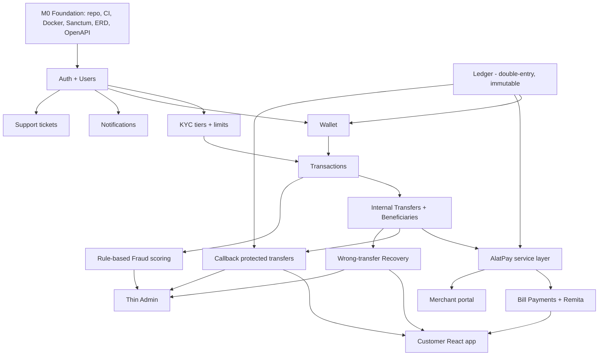

# Reton V1.0 — Build Roadmap

**Date:** 2026-06-22
**Status:** Approved (shape)
**Audience:** Small team (2–4 engineers) + compliance
**Source spec:** `CLAUDE.md` (Reton Pte Ltd master prompt)

---

## 1. Purpose & framing

`CLAUDE.md` describes a full payments platform: ~20 business domains, a Laravel 12
modular monolith, multiple Golang gRPC microservices, three React apps, and a full
observability stack. That is a multi-quarter program of work, not a single build.

This document sequences that work for a **2–4 person team** so that the platform's
only real differentiator — **trust mechanics (Callback protection + wrong-transfer
Recovery)** — is proven as early as possible, without architectural dead-ends.

### The core thesis

Reton competes with Kuda, OPay, FairMoney, and Moniepoint. Bills, airtime, crypto,
and betting are commodity features those incumbents already do well. Reton's wedge is
**trust**: protected transfers, callbacks, and recovery. Therefore the build order is
derived from one question: *what does the moat depend on?*

The answer is an **immutable, double-entry ledger**. Every trust feature is ultimately
a controlled manipulation of held funds. If the ledger is wrong, nothing above it can
be trusted. So the ledger is the spine, and everything sequences off it.

---

## 2. V1 scope decisions (challenging the prompt)

The master prompt over-specifies V1. The following are **deferred** to protect focus
and shipping speed. None of these decisions are irreversible — they are sequencing,
not architecture.

| Deferred from V1 | Rationale |
|---|---|
| **Golang gRPC services** (fraud, callback, notification, risk engines) | The `<50ms` / `<30ms` latency targets are meaningless at zero traffic. Build fraud + callback as Laravel domain services first. Extract hot paths to Go **only** when measured load demands it. Two languages on a 2–4 person team is a tax, not a feature. |
| **Crypto, Betting, Virtual Cards, Savings** | Commodity revenue lines with zero trust differentiation; each carries independent compliance and provider-integration weight. Post-V1. |
| **Reverb / Broadcasting, Scout / Meilisearch** | Polling + Postgres full-text search are sufficient until there are users. |
| **Grafana / Loki / Tempo / Pulse** | Start with Telescope (dev), structured JSON logs, and Sentry. Add the heavy stack at M6 hardening. |
| **Merchant portal** | Last surface. Internal admin and customer app prove the model first. |
| **Full AI support** | M4 ships ticketing + escalation. The AI assistant layers on later. |

### Kept, and kept early

- **Double-entry ledger, immutable accounting** — non-negotiable, M1.
- **AlatPay** as the bank rail (funding, payout, webhooks, reconciliation) — M2.
- **Callback + Recovery + rule-based Fraud** — the moat, M3.
- **Thin Admin** for recovery/callback approvals and the fraud queue — operability is
  a launch requirement, not a nice-to-have. M5.

---

## 3. Non-engineering blocker (must run in parallel)

`reton.ng` operates in **Nigeria (CBN-regulated)** while the entity is **`Pte Ltd`
(Singapore)**. Moving real customer money requires either:

1. A CBN license (MMO / PSSP / Switching & Processing, as applicable), or
2. Operating under a **licensed banking/PSP partner**.

AlatPay (Wema Bank) is the partner rail and is the right call. But the
**legal/compliance track must run continuously from day one** (Track D below). No
amount of clean code unblocks money movement to the public without this. Treat it as a
hard dependency for *go-live*, not for *development* — sandbox work proceeds in
parallel.

---

## 4. Domain decomposition & dependency graph

Each box is an independently spec-able sub-project. Arrows are hard dependencies.

**Critical path (the spine):**
`Foundation → Ledger → Wallet → Transactions → Transfers → AlatPay → Callback/Recovery`.
Everything else hangs off this path and can be parallelized around it.

---

## 5. Milestone spine (exit-criteria based)

Milestones are defined by **exit criteria**, not calendar dates. A milestone is done
when its criteria are demonstrably met (tests + a working demo), not when time elapses.

### M0 — Foundation
- Monorepo layout (`backend/` Laravel, `frontend/` React, `infra/` Docker, `docs/`).
- CI pipeline: lint, static analysis (PHPStan/Larastan), test run on every push.
- Docker Compose: **Laravel + Nginx + Postgres + Redis only** (no Go/MinIO/Meili yet).
- Laravel Sanctum auth scaffold; domain-driven module skeleton (DDD bounded contexts).
- ERD reviewed and committed (Mermaid).
- OpenAPI contract-first workflow established (`/api/v1`, standard success/error/
  validation/pagination envelopes).
- **Exit:** skeleton boots via `docker compose up`, CI is green, ERD approved.

### M1 — Money substrate
- Users domain; KYC tiers (1/2/3) with **enforced** transaction limits.
- **Ledger:** `ledger_accounts`, `ledger_entries` — immutable, append-only,
  double-entry. Balances are *derived*, never stored mutably.
- Wallet domain consumes the ledger; **no balance mutation outside the ledger.**
- Transactions domain (orchestrates ledger postings).
- **Exit:** a wallet can only be credited/debited via balanced ledger entries; a
  property-based test proves `sum(debits) == sum(credits)` holds for every operation
  and that no code path mutates a balance directly.

### M2 — Money movement
- Internal transfers (wallet → wallet) with idempotency keys.
- Beneficiaries.
- **AlatPay service layer** (dedicated, no controller integrations):
  bank transfer, collections, payout, transaction verification, webhook handling,
  signature validation, idempotency, retry, settlement reconciliation, audit logging.
- **Exit:** real money in (funding) and out (payout) in AlatPay sandbox, with a
  reconciliation job that proves ledger balances match AlatPay-reported settlement.

### M3 — The moat
- **Callback protected transfers:** NORMAL vs PROTECTED selection; PROTECTED moves
  funds to `HOLD` on the ledger; receiver sees "PENDING CALLBACK PROTECTION"; sender
  confirm-release / initiate-callback; receiver accept/reject/provide-evidence;
  configurable time limits; admin intervention; decision engine determines outcome.
- **Wrong-transfer Recovery:** report → validate (time elapsed, receiver activity,
  fraud indicators) → temporary hold → notify → voluntary return → escalate. Recovery
  fees. Success-rate tracking.
- **Rule-based Fraud scoring** (Laravel service): velocity, new device, impossible
  travel, large transfers, failed-PIN count, beneficiary mismatch. Score 0–100 →
  Low/Medium/High → Allow/Challenge/Hold/Escalate/Freeze.
- **Exit:** full protected-transfer dispute lifecycle and full recovery flow both work
  end-to-end; **every action is written to `audit_logs`**; fraud score influences at
  least the hold/challenge decision.

### M4 — Surround
- Bill payments + Remita (RRR) behind a **provider abstraction layer**.
- Notifications (SMS/email/push) — Laravel notifications + queues.
- Support tickets (creation, escalation routing) — AI assistant deferred.
- **Exit:** a user can pay a bill / RRR and receive a notification; reconciliation
  closes the loop.

### M5 — Surfaces
- **Customer React app** (TypeScript, React Router, TanStack Query, Zustand, RHF+Zod,
  Tailwind, shadcn/ui): dashboard, wallet, send money, callback, recovery center,
  bills, support, profile, KYC. Built against OpenAPI contracts, tracking M1–M4.
- **Thin Admin:** fraud queue, recovery approvals, callback interventions, audit-log
  viewer.
- **Exit:** clickable end-to-end customer journey; an admin can resolve a callback and
  approve a recovery.

### M6 — Hardening & launch readiness
- Observability: Prometheus + Grafana + Loki + Tempo; business/fraud/recovery KPIs.
- Security review (OWASP pass, rate limiting, idempotency audit, webhook signatures,
  encryption at rest/in transit, device fingerprinting, 2FA).
- Load test the money path; validate P95 < 300ms.
- **Coverage push targeted at money-path domains** (Ledger, Wallet, Transfers,
  AlatPay, Callback, Recovery, Fraud) — 90% there, pragmatic elsewhere.
- Merchant portal.
- **Exit:** pilot-launch-ready; money-path domains at 90% coverage; security review
  signed off; compliance (Track D) confirms go-live path.

---

## 6. Track split for a 2–4 person team

| Track | Owner | Scope |
|---|---|---|
| **A — Money/backend** | Strongest engineer | Ledger → Transfers → AlatPay → Callback/Recovery/Fraud. The critical path. |
| **B — Frontend** | Frontend engineer | Design system + auth + dashboard first, then consume Track A's OpenAPI contracts milestone-by-milestone. Never blocked, because contracts land before implementation. |
| **C — Platform (part-time)** | Shared with A | Docker, CI, migration discipline, observability. |
| **D — Compliance (non-eng)** | Founder/legal | Licensing/partner path, KYC/AML policy, AlatPay agreement. Runs continuously. |

With only 2 engineers, collapse to: one on Track A+C, one on Track B; compliance owned
by the founder. The contract-first rule still keeps them unblocked.

---

## 7. Cross-cutting engineering rules (baked into every milestone)

1. **Contract-first.** OpenAPI for an endpoint is written and reviewed *before*
   implementation, so the frontend is never blocked on the backend.
2. **No balance mutation outside the ledger.** Enforced by code review and a test that
   greps/asserts no direct balance writes exist.
3. **Idempotency on every external boundary.** All AlatPay calls, all webhooks, all
   money-moving endpoints accept and dedupe idempotency keys.
4. **Everything money-touching is audit-logged.** `audit_logs` is append-only.
5. **Coverage budget follows risk.** Money-path domains get 90%; UI glue gets
   pragmatic coverage. Don't spend the budget uniformly.
6. **Immutable accounting.** Ledger entries are never updated or deleted; corrections
   are compensating entries.

---

## 8. What "done with the roadmap" unlocks

Each milestone is itself a brainstorming → spec → plan → implementation cycle. The
recommended next step is to take **M0** (or M1 if infra is trivial for this team) into
its own design/spec and begin. This roadmap is the parent; each milestone is a child
spec.

### Immediate next actions
1. Compliance (Track D): open the CBN-partner / AlatPay agreement conversation now.
2. Engineering: spec **M0 Foundation** in detail (repo layout, Docker, CI, DDD module
   skeleton, OpenAPI tooling) and start building.
3. Lock the ERD review for M1 — the ledger schema is the highest-leverage decision in
   the entire project; get it reviewed by someone who has built double-entry systems.

---

## 9. Open questions to resolve before M1

- **Ledger granularity:** one ledger account per wallet, or sub-accounts per
  fund-state (available / held / pending-settlement)? (Recommendation: explicit
  sub-accounts — makes Callback holds and Recovery holds first-class, not flags.)
- **Currency:** NGN-only for V1, with multi-currency *readiness* in the schema
  (currency column, minor-units integer storage) but no FX. Confirm.
- **AlatPay sandbox access:** obtained? Credentials and webhook URL provisioned?
- **KYC provider:** BVN/NIN verification provider chosen, or stubbed behind the
  abstraction until selected?
